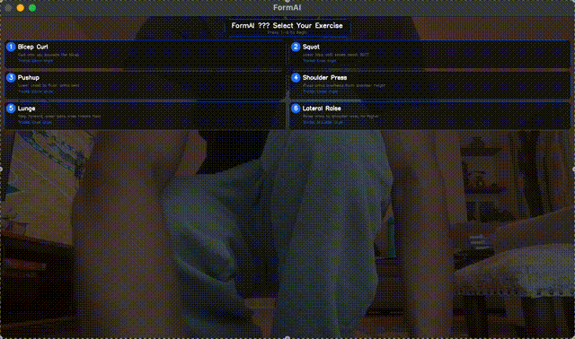

# FormAI — Real-Time AI Fitness Coach

FormAI uses your webcam and MediaPipe's pose estimation to count exercise reps automatically and give real-time form feedback — no wearables, no gym equipment required.



---

## Key Features

- **Automatic rep counting** — joint angles are tracked frame-by-frame; a rep registers only when the full range of motion is completed
- **Form feedback** — colored skeleton (green/orange) and on-screen text cue common mistakes per exercise
- **Good-form gate** — reps performed with bad form are silently skipped so the count reflects quality work
- **Bilateral limb tracking** — automatically detects whichever arm or leg is actively moving using per-frame angle comparison with noise clamping
- **Voice feedback** — Mac TTS announces milestones and form corrections without interrupting the video loop
- **Session summary** — per-exercise rep breakdown shown on-screen and in the terminal at the end of each session
- **6 exercises** — bicep curl, squat, pushup, shoulder press, lunge, lateral raise

---

## How It Works

```
Webcam frame
    │
    ▼
MediaPipe PoseLandmarker     ← 33 body keypoints, normalized (0–1) coordinates
    │
    ▼
calculate_angle(a, b, c)     ← arctan2-based angle at the tracked joint
    │
    ▼
FormChecker.check()          ← per-exercise rules → (feedback_text, good_form)
    │
    ▼
RepCounter.update()          ← state machine: down → up → count (if good_form)
    │
    ▼
OpenCV HUD overlay           ← glassmorphism panels + animated +1 flash
```

---

## Tech Stack

| Component | Library / Tool |
|-----------|---------------|
| Pose estimation | MediaPipe Tasks API (`PoseLandmarker`) |
| Computer vision | OpenCV (`cv2`) |
| Angle math | NumPy (`arctan2`) |
| Audio feedback | `sounddevice` (beep), macOS `say` (TTS) |
| Language | Python 3.11 |

---

## Installation

**Requirements:** Python 3.10+, macOS (TTS uses the built-in `say` command)

```bash
# 1. Clone the repo
git clone https://github.com/Shiven01000/FormAI.git
cd FormAI

# 2. Create and activate a virtual environment
python3 -m venv venv
source venv/bin/activate

# 3. Install dependencies
pip install -r requirements.txt

# 4. Download the MediaPipe pose model (~5 MB)
curl -O https://storage.googleapis.com/mediapipe-models/pose_landmarker/pose_landmarker_lite/float16/1/pose_landmarker_lite.task

# 5. Run
python main.py
```

---

## Exercises

| # | Exercise | Tracked Joint | Rep trigger |
|---|----------|--------------|-------------|
| 1 | Bicep Curl | Elbow | Arm extends back to ~150° |
| 2 | Squat | Knee | Knee straightens past 160° |
| 3 | Pushup | Elbow | Arms extend past 160° |
| 4 | Shoulder Press | Elbow | Arms extend overhead past 160° |
| 5 | Lunge | Knee | Front leg straightens past 160° |
| 6 | Lateral Raise | Shoulder | Arm reaches 65–100° from side |

**Controls** (video window must be focused):

| Key | Action |
|-----|--------|
| `1–6` | Switch exercise |
| `R` | Reset rep count |
| `Q` | Quit / view session summary |

---

## Architecture

For a technical deep-dive into the design decisions (angle math, state machine, extensibility pattern, bilateral tracking), see [`docs/architecture.md`](docs/architecture.md).

---

## Limitations / Future Work

- **Side-view only for lower body** — knee angle accuracy drops when facing the camera directly; a front-facing squat mode would require a different landmark set
- **Single-person** — only the first detected pose is processed
- **macOS TTS** — voice feedback calls `say`, which is Mac-only; Linux/Windows would need a cross-platform TTS library
- **Form checks suspended at peak curl angle (< 60°)** — elbow span naturally exceeds shoulder span when forearms are vertical, making threshold-based detection unreliable at the peak. A depth camera would resolve this.
- **Pushup and lunge detection is sensitive to camera angle and distance** — works best when the full body is visible from the side
- **Planned:** iPhone app using AVFoundation + Create ML for on-device inference
